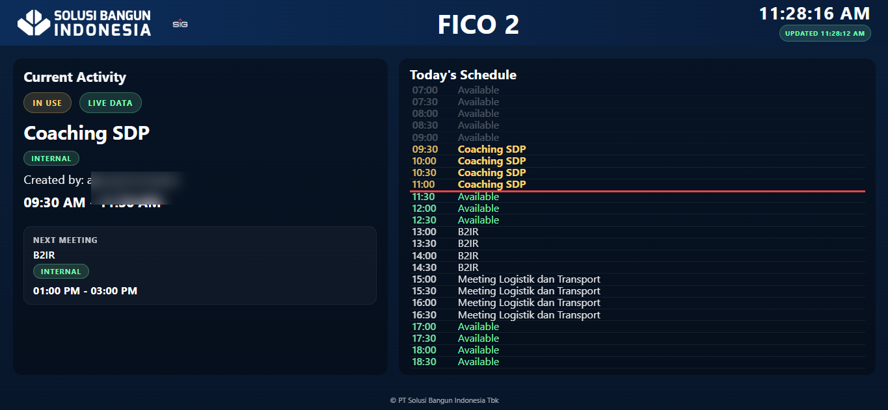
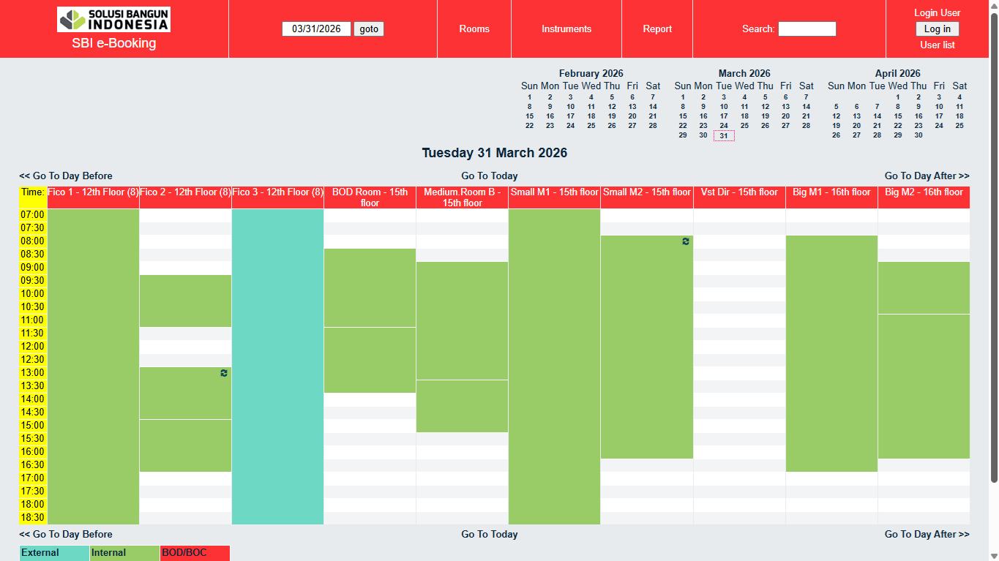
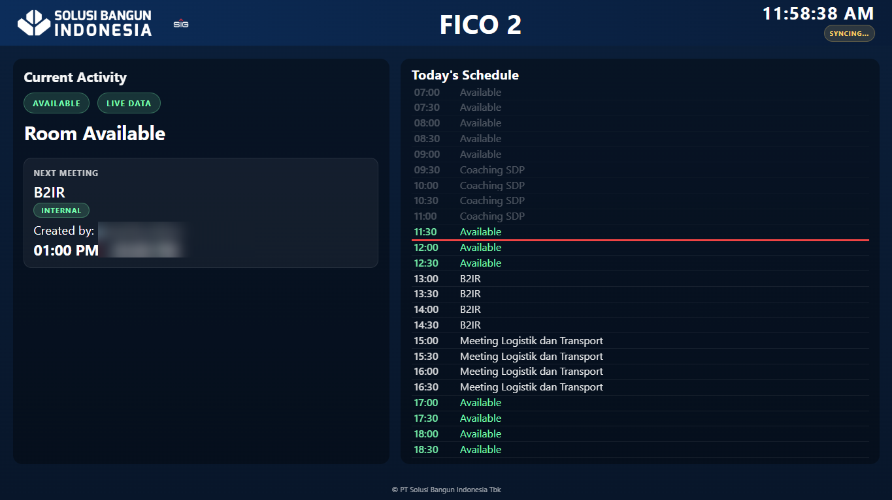
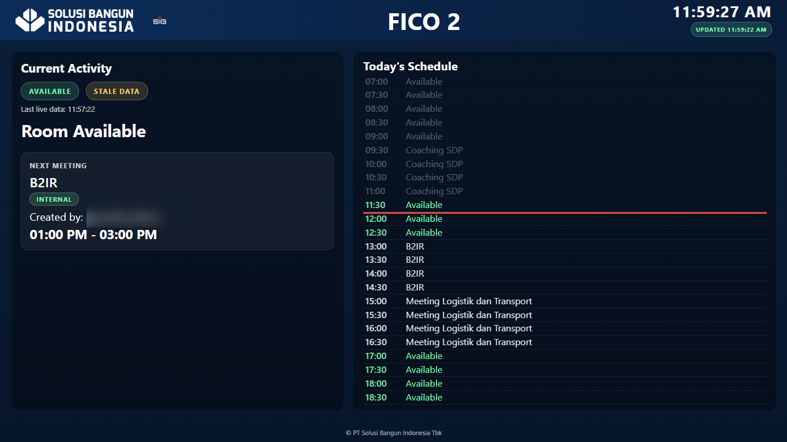
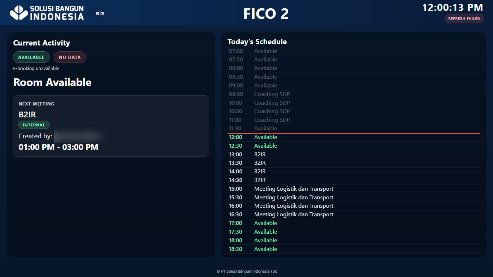
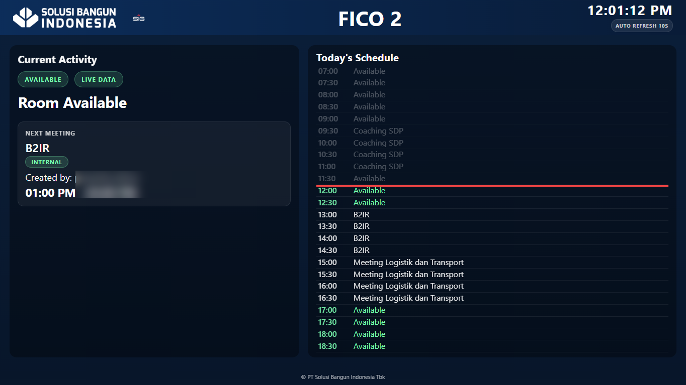

# SBI TV Dashboard Occupancy

TV dashboard for room-occupancy monitoring and daily meeting visibility.

## Overview

This project displays room status for SBI meeting rooms in a TV-friendly layout.  
It reads schedule data from an internal e-booking source, transforms it into a room timeline, and highlights:

- current room occupancy
- next scheduled meeting
- full-day schedule visibility
- runtime data-health and sync states

## Main UI Example

## Source Schedule Example

## Data Status

- **Live Data**: latest source data loaded successfully.
- **Stale Data**: last known good data is shown because the newest fetch failed.
- **No Data**: no usable source data is available.

## Sync Status

- **Auto Refresh 10s**: waiting for the next automatic refresh cycle.
- **Syncing...**: refresh request is currently in progress.
- **Updated**: refresh succeeded and new data has been applied.
- **Refresh Failed**: refresh failed; the previous display remains visible and retry continues automatically.

## Status Handling Use Cases

### 1. Live Data + Syncing

### 2. Stale Data + Updated

### 3. No Data + Refresh Failed

### 4. Live Data + Auto Refresh 10s

